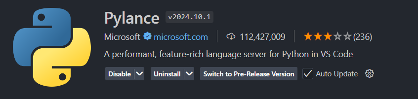
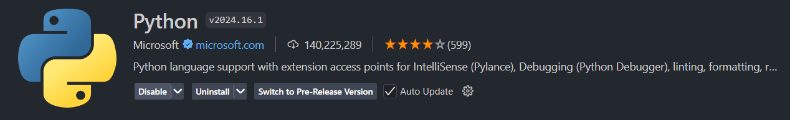
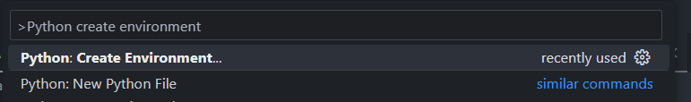
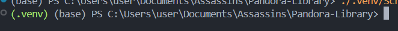

# PhantomX-Assassins Library

> **Internal Use Only**: This library is developed exclusively for PhantomX-Assassin's robot.

## Prerequisites

Before you begin, ensure you have:
- Internet connection for downloading tools and libraries
- GitHub account with access to this repository
- Your Laura robot's Bluetooth name

## Setup Guide

### VS Code (Recommended)
To use this library with VS Code, there is some manual setup needed before it can be used.

### Step 1: Install VS Code
1. Download and install [Visual Studio Code](https://code.visualstudio.com/)
2. Launch VS Code after installation

### Step 2: Install Python
- **Windows**: Install Python from the [Microsoft Store](https://apps.microsoft.com/store/detail/python-311/9NRWMJP3717K) (Python 3.11 recommended)
- **Mac/Linux**: Python may already be installed. Check by opening Terminal and typing `python3 --version`


### Step 3: Install Required VS Code Extensions
1. Open the Extensions panel (`Ctrl + Shift + X` or `Cmd + Shift + X` on Mac)
2. Search for and install the following extensions:
   - **Python** (by Microsoft)
   - **Pylance** (by Microsoft)

   
   

### Step 4: Clone the Repository
1. In VS Code, press `Ctrl + Shift + P` (`Cmd + Shift + P` on Mac) to open the Command Palette
2. Type `Git: Clone` and select it
3. Enter this repository's URL
4. Choose a location to save the project

### Step 5: Create Python Virtual Environment
1. Open the Command Palette (`Ctrl + Shift + P` or `Cmd + Shift + P`)
2. Type `Python: Create Environment` and select it
3. Choose `Venv` when prompted
4. Select your Python interpreter (the one from Microsoft Store or your system Python)
5. Wait for the `.venv` folder to be created in your workspace

   


### Step 6: Activate the Virtual Environment
1. Open the Command Palette again
2. Type `Python: Create Terminal` and select it
3. A new terminal should open with `(.venv)` at the beginning of the prompt

   

   **If the environment is not activated automatically:**
   - **Windows**: Run `.\.venv\Scripts\activate`
   - **Mac/Linux**: Run `source .venv/bin/activate`

### Step 7: Install Required Libraries
In the activated terminal (with `.venv` showing), run these commands:

```bash
pip install pybricks
```

```bash
pip install pybricksdev
```

These install:
- **pybricks**: The core library for programming your robot
- **pybricksdev**: Tools for uploading code to your robot


### Step 8: Configure Robot Names
1. Navigate to `.vscode/tasks.json` in your workspace
2. Locate the `inputs` section at the bottom of the file
3. Update the `options` array with your robot names:

```json
"inputs": [
    {
        "type": "pickString",
        "id": "robotName",
        "description": "Which Robot?",
        "options": [
            "Echo",
            "Nova",
            "Your Robot Name Here"
        ]
    }
]
```

### Step 9: Set Up Keyboard Shortcuts
1. Press `Ctrl + Shift + P` (`Cmd + Shift + P` on Mac) to open Command Palette
2. Type `Preferences: Open Keyboard Shortcuts (JSON)` and select it
3. If the file is empty, add square brackets `[]`
4. Paste this inside the brackets:

```json
[
    {
        "key": "ctrl+shift+l",
        "command": "workbench.action.tasks.runTask",
        "args": "Run robot on Mac"
    },
    {
        "key": "ctrl+alt+l",
        "command": "workbench.action.tasks.runTask",
        "args": "Run robot on Windows"
    }
]
```

**Note**: Mac users should use `Ctrl + Shift + L`, Windows users should use `Ctrl + Alt + L`

## Running Your Robot

1. Open any `.py` file with your robot code
2. Press your keyboard shortcut:
   - **Windows**: `Ctrl + Alt + L`
   - **Mac**: `Ctrl + Shift + L`
3. Select your robot from the dropdown menu
4. The code will compile and upload to your robot automatically

> If you want to know how to set your robot name into environment variables, please check out this [README file](https://github.com/FLL-Team-24277/FLL-Fall-2024-Submerged/tree/main/.vscode)
